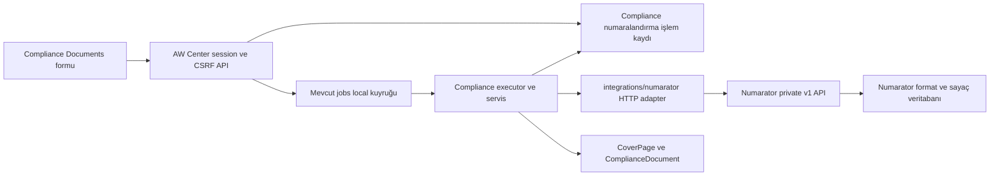

# Numarator entegrasyon mimarisi

Durum: yeni belge ve mevcut boş cover page tahsisi, arayüzden format seçimi, durable job,
idempotent retry, yerel bağlama ve `used` bildirimi hazırdır. Replacement, cancel
ve operatör mutabakat ekranı bu belgedeki sonraki dilim olarak kalır.
İlk kullanım: Compliance Documents içinde cover page numarası oluşturma ve kullanma.
Yerel kurulum ve birlikte çalıştırma: [yerel entegrasyon rehberi](numarator-local-development.md).
İncelenen kaynaklar: AW Center `4a636f8`, Numarator `27a7d86` (5 Eylül 2026).

## Karar

Numarator, numara formatının, sayacın ve tahsis kaydının tek sahibidir. AW Center,
numaranın hangi projedeki cover page için kullanıldığının ve belge yaşam döngüsünün
sahibidir. İletişim yalnız sunucular arasında Numarator özel HTTP API'siyle yapılır.
Veritabanı paylaşımı, Numarator Python kodunun AW Center'a kopyalanması veya
tarayıcıdan Numarator'a erişim gerekmez.

Numara üretimi, mevcut durable job altyapısında çalışır. İşlem kimliği job
denemesinden bağımsızdır; tekrar denemeler aynı tahsisi tamamlar. İki veritabanı
arasında ortak transaction varsayılmaz. Kalıcı işlem kaydı ve mutabakat sayesinde
uzak başarı/yerel hata durumları izlenebilir ve tamamlanabilir.

## Mevcut koddan doğrulanan sözleşmeler

| Konu | Mevcut davranış ve etkisi |
| --- | --- |
| Cover page | `compliance.CoverPage`, proje içinde numarasıyla tekildir; birden fazla belge paylaşabilir. Tahsis belge başına değil yeni cover page başınadır. |
| Sürüm | Hem belge hem cover page `version` taşır. Yeni entegrasyon bunları ve history/review davranışını korumalıdır. |
| Uzunluk | AW Center cover numarası en fazla 32, Numarator numarası en fazla 200 karakterdir. İlk kapsamda format çıktısı 32 karakterle sınırlanır; kesilmez. |
| Mevcut giriş | Serializer elle girilen numarayı bulur veya cover page oluşturur. Excel/DOORS import da numarayı kullanır. Bu yollar korunur. |
| DOCX üretimi | `excel.cover_pages` yüklenen Excel'deki numarayı kullanır. Numara tahsisinden ayrı bir işlemdir. Dosyanın yeniden üretilmesi yeni numara tüketmez. |
| Uzak üretim | `POST /api/private/v1/numbers/`, `X-API-Key` ve zorunlu `Idempotency-Key` alır. Aynı credential/key/payload aynı kaydı döndürür. |
| Uzak durum | Yalnız `active → used` veya `active → cancelled`; aynı terminal durum tekrarlanabilir. `used` için `valid=false` dönmesi numaranın yanlış olduğu anlamına gelmez. |
| Uzak yetki | Kayıt okuma/durum değiştirme format izinleriyle sınırlandırılmıştır; `source_credential` üzerinden sahiplik filtresi yoktur. |
| Rotasyon | Idempotency `(credential, key)` kapsamındadır. Yeni API anahtarıyla aynı key yeni numara üretebilir. `external_reference` indekslidir, tekil değildir. |
| Replay sınırı | Aktif format ve güncel context doğrulaması replay sorgusundan önce yapılır. Format değişikliği/devre dışı bırakma eski isteğin tekrarını engelleyebilir. |

Numarator sözleşmesinin kaynağı kendi reposundaki `docs/private-api.md` ve
`docnumber/apps/integrations/{private_views,services,models}.py` dosyalarıdır.

## Kullanıcı akışı

Formda cover page için üç seçenek sunulur: mevcut numarayı kullan, elle gir,
Numarator'dan yeni numara al. Mevcut davranış varsayılan olarak korunur;
entegrasyon yapılandırılmış projelerde üçüncü seçenek açılır.

Yeni numara, form açılınca veya alan değişince üretilmez. Kullanıcı yeni numara
seçeneğiyle kaydettiğinde, doğrulanmış formun snapshot'ı üzerinden işlem başlar.
Ekranda işlem durumu gösterilir; tamamlanınca gerçek numara ve kaydedilmiş belge
döner. İsteğin cevabı kaybolursa aynı istemci işlem UUID'siyle tekrar gönderilir.
Sayfa yenilenince işlem proje kapsamındaki durum endpointinden bulunabilir.

Mevcut bir cover page'e belge eklemek, issue değiştirmek, export almak veya DOCX
dosyasını yeniden üretmek yeni numara tüketmez. Mevcut belgenin yeni cover page'e
geçirilmesi açık bir kullanıcı seçimidir: yalnız hedef belgenin FK'sı değiştirilir,
eski paylaşılan cover page'in numarası değiştirilmez. Diğer belgeler etkilenmez.

İlk sürüm Excel/DOORS import sırasında otomatik numara üretmez. Manuel veya import
numaralarından uzakta sahiplik/tahsis kaydı çıkarılmaz; Numarator'a otomatik `used`
gönderilmez. Eski kayıtları taşıma ayrı bir iş gerektirir.

## Modül sınırları ve kalıcı veri

| Önerilen yer | Sorumluluk |
| --- | --- |
| `backend/integrations/numarator/client.py` | Sabit origin, timeout, kimlik doğrulama, yanıt doğrulama ve güvenli hata dönüşümü. Format oku/preview, üret, sorgula, durum değiştir. Compliance modeli import etmez. |
| `backend/compliance/numbering.py` | Proje yetkisi, format/context seçimi, işlem oluşturma, cover page bağlama ve mutabakat kuralları. |
| `backend/compliance/numbering_executor.py` | Mevcut job lease'i altında adımları yürütür; client ile domain servisini birleştirir. |
| `backend/compliance/models.py` ve yeni migration | Aşağıdaki işlem kaydı. Mevcut migration geçmişi değiştirilmez. |
| `backend/compliance/api.py`, `urls.py`, serializer'lar | Proje kapsamlı başlatma/okuma/devam etme API'si. |
| `backend/automations/catalog.py` | `compliance.allocate_cover_page_number`, `local`, upload yok, başlangıç timeout'u 120 saniye. |
| Frontend `features/compliance/api`, `composables`, `components` | Form seçimi, sabit istemci işlem kimliği, durum takibi; component doğrudan HTTP client kullanmaz. |

`CoverPageNumberAllocation` modeli, compliance'a özgü bir işlem kaydıdır;
generic resource/purpose registry veya yeni Django app gerekmez. İleride DCC gibi
bir tüketici aynı HTTP adapter'ını kullanabilir; kendi bağlama kurallarını yönetir.

İlk dilimde kayıtta tutulan alanlar:

- UUID; `project`; başlatan kullanıcı ve istemci işlem UUID'si.
- Doğrulanmış belge snapshot'ı; sabit `format_code`, `context_data`, metadata,
  `external_reference`, payload hash ve uzak idempotency key.
- Credential'ın secret olmayan sürüm referansı;
  raw API anahtarı hiçbir snapshot/job/modelde tutulmaz.
- Dönen uzak kayıt ID'si, tam numara, son uzak durum; oluşan `CoverPage` ile
  nullable one-to-one bağlantı; oluşan/hedef belge ile bağlantı.
- İşlem aşaması, optimistic `version`, `current_job`, hata kodu, deneme/zaman
  bilgileri ve uzak request ID.

Veritabanı kısıtları: `(project, actor, client_operation_id)` ve cover page/belge
bağlantıları tekildir. İlk dilim ortam başına tek Numarator instance'ı destekler.
İstemci anahtarının farklı payload ile kullanılması `409` döndürür. Yeni belgede
iki farklı istemci kimliği iki ayrı iş talebidir; içerik benzerliğinden sessiz
deduplication yapılmaz. İşlem audit'i job artifact retention'dan bağımsız korunur.

## İşlem ve transaction sırası

1. **Kabul:** session/CSRF, proje `EDITOR` yetkisi, form, proje/panel ilişkisi,
   format eşlemesi ve beklenen sürümler doğrulanır. Kısa transaction içinde işlem
   snapshot'ı ile job birlikte oluşturulur. Commit edilmeden uzak çağrı yapılmaz.
   İşlem zaten varsa aynı payload için aynı işlem döner. İş kaybolmasına karşı
   yalnız `on_commit` callback'ine veya process belleğine güvenilmez.
2. **Tahsis:** worker güncel yetki/proje ve lease'i kontrol eder; HTTP isteğini
   veritabanı transaction'ı dışında yapar. Örnek uzak key:
   `awc-cover-page:<allocation-uuid>`. `external_reference` aynı
   işlem kimliğidir. Retry yeni job ID'si veya yeni payload üretmez.
3. **Tahsis sonucunu sakla:** kısa, lease ile fenced transaction içinde uzak ID,
   numara ve durum kaydedilir. Format, referans, uzunluk ve response tipleri
   doğrulanır. 32 karakteri aşan veya eşleşmeyen yanıt bağlanmaz; işlem incelemeye
   alınır. `used` replay yalnız bu işlemle doğrulanmış ilişki varsa kabul edilir.
4. **Yerel bağlama:** job lease'i, işlem ve hedef domain satırları tutarlı sırada
   kilitlenir. Yetki, aktif belge/proje ve sürümler yeniden doğrulanır. Yeni
   `CoverPage`, belge oluşturma/FK güncelleme, history ve gerekli pending-review
   supersede işlemleri aynı transaction'da yapılır. İşlem `use_pending` olur.
   Mevcut serializer/service kuralları ortaklaştırılarak kullanılır; bulk update
   ile aşılmaz. Aynı proje/numara zaten başka cover page'e aitse otomatik birleşme
   yapılmaz; conflict kaydedilir.
5. **Kullanımı bildir:** commit sonrası `PATCH .../numbers/{id}/status/` ile `used`
   gönderilir. Başarılı durum cevabı doğrulanınca işlem tamamlanır. Geçici hata
   olursa yerel kayıt geri alınmaz; kalıcı `use_pending` üzerinden tekrar denenir.
   Bu aşama tamamlanmadan UI “tamamlandı” göstermez; kaydedilmiş belgeyle beraber
   “numara kullanım bildirimi bekliyor” gösterir.

Her yerel domain commit'inde mevcut `jobs.execution` lease/token kontrolü aynı
transaction içinde yapılır. Süresi dolmuş worker domain state'i de yayımlayamaz.
Uzak isteği lease kaybıyla geri almak mümkün değildir; kalıcı idempotency ve
durum sorgusu bu pencereyi kapatır. Job retry aynı allocation'ı taşır; eski job
`current_job` eşleşmesini geçemez. İlerleme monotonic, terminal job yazımı CAS
ile fenced kalır.

Job kernel'i artifact sonucu beklediğinden executor mevcut sözleşmeye uygun küçük,
owner-scoped JSON sonuç artifact'ı üretir (işlem, belge ve cover page kimlikleri).
Credential/upstream gövdesi içermez. UI'nin kalıcı durum kaynağı artifact değil
allocation endpointidir; artifact SHA-256/download/retention kuralları korunur.

## Hata, iptal ve mutabakat

| Durum | Karar |
| --- | --- |
| Üretim timeout'u veya 5xx | Aynı credential/key/snapshot ile sınırlı retry; yeni tahsis yok. |
| 429 | `Retry-After` ve sınırlı backoff; HTTP katmanında gizli POST retry yok. |
| 400/401/403/404/422 | Otomatik tekrar durur, güvenli yapılandırma/validasyon hatası gösterilir. |
| 409 veya belirsiz response | Uzak ID/ref ile mutabakat; yeni key ile üretim yapılmaz. |
| Tahsis sonrası yerel sürüm değişmiş | Belgeye yazılmaz. Tahsis korunur; editor güncel veriyi inceleyerek aynı tahsisi devam ettirir veya iptal eder. İlk snapshot audit için korunur; güncel bağlama onayı ayrı kaydedilir. |
| Yerel commit sonrası status timeout | Aynı uzak ID'ye `used` tekrar gönderilir. Belge/numara ikinci kez oluşturulmaz. |
| Uzak kayıt cancelled/expired | Başka numara otomatik atanmaz; inceleme gerekir. Yerelde bağlanmışsa operasyonel tutarsızlık görünür kılınır. |
| Kullanıcı vazgeçti | Uzak çağrı başlamadıysa iptal. Çağrı başlamış/belirsizse önce mutabakat; doğrulanmış active ve bağlanmamış kayıt iptal edilebilir. |
| Belge arşivlendi / issue değişti | Kullanılmış numara iptal edilmez ve yeniden havuza alınmaz. |

İlk dilimde işlem aşamaları `requested`, `allocated`, `use_pending`, `completed`
ve `reconciliation_required` olarak tutulur. Retry
edilebilir hata son tamamlanan aşamayı silmez. İptal niyeti ve hata bilgisi ayrıca
saklanır. İptal ile bağlama aynı işlem kilidi altında yarışır: bağlama kazandıysa
iptal uzak `cancelled` gönderemez; iptal kazandıysa bağlama yapılamaz.

Başlamış uzak yan etkiden sonra generic job cancel durumu, allocation tamamlandı
veya iptal edildi anlamına gelmez. Proje kapsamlı devam/mutabakat servisi gerekirse
aynı allocation için yeni local job oluşturur. Recovery taraması açık tahsisleri
tespit eder; belirsiz sonucu yeni numara üreterek çözmez. Sınırlı denemelerden sonra
kayıt, mevcut reconciliation modeliyle kullanıcı/operatör müdahalesine bırakılır.

Numara serisinde boşluk olmaması garanti edilmez. Vazgeçilmiş/iptal edilmiş
numaralar audit kaydıdır; sayaç geri sarılmaz.

## AW Center HTTP sözleşmesi

Tüm yollar `/api/projects/<project_slug>/compliance-documents/` altındadır.
Mevcut create/update endpointlerinin manuel sözleşmesi değişmez.

| Yol | Yetki ve davranış |
| --- | --- |
| `GET numbering-options/` | Viewer; yalnız bu projedeki uygun seçenekler ve güvenli context alanları. Secret, origin ve internal handler metadata'sı dönmez. |
| `POST number-allocations/` | Editor + CSRF; istemci UUID'si ve yeni belge formu; `202` ve allocation/job ID. |
| `GET number-allocations/?document_id=<uuid>` | Editor; actor/manager görünürlüğüyle mevcut belgenin tamamlanmamış tek tahsisini döndürür. Form yeniden açılınca aynı işlem sürdürülebilir. |
| `GET number-allocations/<uuid>/` | Proje erişimi ve actor/manager kontrolü; aşama, güvenli hata, kaydedilmiş belge/numara. |
| `POST number-allocations/<uuid>/resume/` | Editor + actor/manager + CSRF; güncel allocation/domain sürümü ve gerekiyorsa açık bağlama onayı. Aynı tahsisle devam eder. |

Genel listeleme ve cancel endpointleri ile replacement işlemi henüz açılmamıştır.

Numarator base URL'si, serbest format kodu, metadata ve project context'i
tarayıcıdan güvenilir kabul edilmez. Backend proje eşlemesinden üretir; kullanıcı
yalnız izinli iş alanlarını seçer. Hatalar AW Center'ın `{detail, code, request_id}`
sözleşmesine çevrilir; upstream mesajları doğrudan yansıtılmaz.

## Yapılandırma ve Numarator tarafındaki önkoşullar

- Ortam başına sabit Numarator instance kimliği, HTTPS origin, secret referansı
  ve credential sürümü. Başlangıç HTTP connect/read timeout'ları 3/10 saniye;
  redirect kapalı, TLS doğrulaması açık, yanıt boyutu sınırlı.
- Proje slug → cover page format kodu ve izinli context eşlemesi backend'de
  doğrulanan deployment ayarıdır. İş verisi/rol registry'ye taşınmaz. Formatın
  gerçek kodu, format UUID'si ve gerekli alanları kurulum sırasında okunur;
  örnek bir format adı production'da var kabul edilmez.
  `NUMARATOR_PROJECT_FORMATS` değerleri tek kod veya kod listesi olabilir:
  `{"ozgur":["COVER_PAGE","COVER_PAGE_YEAR"]}`. Seçenekler bu sunucu allowlist'inden
  arayüze verilir. Birden fazla format varsa kullanıcı seçim yapmalıdır;
  tek kodlu eski yapılandırma varsayılanını korur. İstemcinin `format_code` alanı
  aynı allowlist'e karşı doğrulanır ve idempotency snapshot'ına kaydedilir.
  Liste Numarator'dan her form açılışında otomatik keşfedilmez; yönetici gerçek
  aktif format kodlarıyla API anahtarının format izinlerini birlikte yapılandırır.
- Proje için ayrı sayaç gerekiyorsa ayrı Numarator formatı gerekir. Mevcut sayaç
  `(format, period)` kapsamındadır; yalnız context'e project eklemek sayacı ayırmaz.
- İlk sürümde AW Center ortamına ayrılmış formatlar ve bu UUID'lerle sınırlı API
  anahtarı kullanılır. Boş `allowed_formats` tüm formatları açtığı için kullanılmaz.
  Gerekli scope'lar `formats:read`, `numbers:generate`, `numbers:read`, `numbers:status`.
- İlk sürümde credential rotasyonu kontrollüdür: eski credential'a bağlı açık
  işlemler bitmeden eski anahtar iptal edilmez. Yeni işler yeni credential'ı,
  eski işler kayıtlı credential sürümünü kullanır. Acil iptalde eski anahtarlı
  belirsiz üretimler durdurulur; yeni anahtarla POST tekrarlanmaz. Tam eşleşen ref,
  format/context/metadata ile tek kayıt doğrulanırsa mutabakat yapılabilir;
  sıfır sonuç, eski istek halen çalışıyor olabileceğinden yeni üretime izin vermez.
- Uzun vadede Numarator'da kalıcı integration-client kimliği altında credential
  rotasyonu ve `(client, idempotency_key)` tekilliği önerilir. Aynı format farklı
  uygulamalarca paylaşılacaksa kayıt sahipliği client ile scope edilmelidir.
  Bunlar mevcut private API'nin sunduğu garantiler değildir.
- Açık tahsis varken format kodu/context sözleşmesi değiştirilmez veya format
  kapatılmaz. Otomatik/serbest rotasyon ve format değişimi istenirse Numarator'da
  replay'i yeni üretim validasyonundan ayıran uyumlu API geliştirmesi gerekir.
- Numaranın `active` olduğu yerel bağlama–`used` bildirimi aralığında başka
  yönetim işlemleriyle iptal edilmesini API atomik olarak engellemez. Ayrılmış
  formatların yönetim prosedürü bu tahsisleri değiştirmemeli; tespit edilen çakışma
  mutabakata gitmelidir. Sistemler arası atomiklik iddiasında bulunulmaz.
- Üretim/status credential'ı yalnız local worker'a verilir. Web süreci seçenekleri
  yerel doğrulanmış eşlemeden sunar; gerekiyorsa format keşfi de local job üzerinden
  yapılır. Notification/cleanup worker ve DOORS worker bu credential'ı almaz.
  Numarator kesintisi AW Center liveness'ını veya mevcut belge okumalarını bozmaz.

## Uygulama sırası ve kabul testleri

1. Format/context ve credential hazırlığı; 32 karakter sınırı, format erişimi,
   sayaç kapsamı, rotasyon prosedürü ve ayrı ortam doğrulaması.
2. HTTP adapter, mock HTTP contract testleri; credential/redirect/yanıt doğrulaması.
3. Allocation modeli ve yeni migration; domain servisleri, job catalog/executor,
   recovery ve API. PostgreSQL üzerinde migration ve concurrency testleri.
4. Formdaki üretim seçeneği ve işlem takibi; manuel giriş ve import regresyonları.
5. Deployment secret sınırları, entegrasyon readiness/probe, test ortamında iki
   servisle uçtan uca doğrulama; sonra ilgili projede özellik açılır.

Asgari kabul senaryoları:

- Aynı istek ve eşzamanlı çift tıklama bir tahsis/belge üretir; farklı payload 409.
- Uzak commit sonrası kopan bağlantı, local commit sonrası worker çökmesi,
  status cevabının kaybı ve lease kaybı yeni numara tüketmeden toparlanır.
- İki worker ve iki editor yarışı PostgreSQL üzerinde sınanır; stale worker
  history/domain yazamaz, eski belge/cover sürümü overwrite edilmez.
- Viewer/anonim/başka proje ve CSRF'siz istek üretim yapamaz; kuyruğa alındıktan
  sonra yetkisi alınan actor için domain bağlama yapılmaz.
- Paylaşılan cover page, issue değişikliği, import, arşiv ve DOCX tekrar üretimi
  tahsis başlatmaz. Replacement yalnız seçilen belgeyi değiştirir.
- Anahtar rotasyonu, format kapanması, 32 karakter taşması, bozuk JSON, 429,
  canceled uzak kayıt ve belirsiz iptal güvenli şekilde görünür kalır.
- Preview testleri sıra tüketmez; `used` için `valid=false` başarıyı bozmaz.
- `use_pending` recovery, job retry/cancel ve artifact retention birbirinden
  bağımsız doğrulanır. Log/response/snapshot içinde API anahtarı bulunmaz.

Bu tasarım belgesi için runtime testleri uygulanmaz. Implementasyonda repository
rehberindeki backend check/migration, ilgili compliance/jobs/integration testleri,
frontend typecheck/test/E2E/build ve deployment contract kapıları çalıştırılmalıdır.
